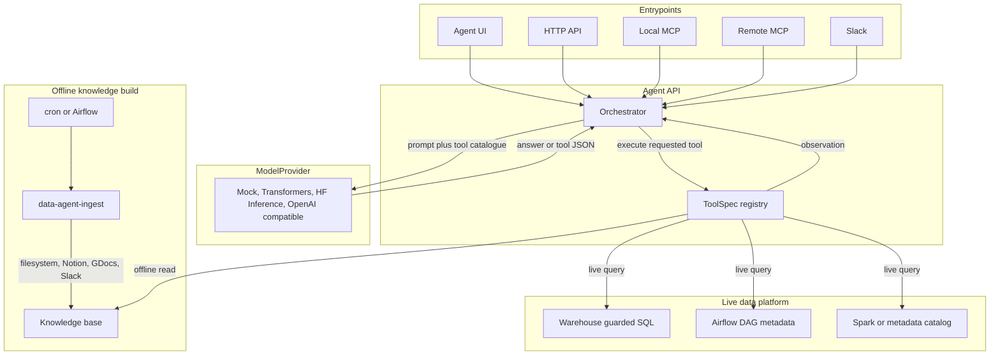

# hf-data-agent

[](https://github.com/DiogoRibeiro7/hf-data-agent/actions/workflows/ci.yml)
[](https://github.com/DiogoRibeiro7/hf-data-agent/actions/workflows/codeql.yml)
[](pyproject.toml)
[](LICENSE)
[](pyproject.toml)
[](https://github.com/astral-sh/ruff)

An internal **data agent**: several entrypoints funnel into one Agent API, which
grounds an **open-source LLM from Hugging Face** in your company knowledge base
and lets it pull fresh numbers from your data platform.



The shape is intentional. Every entrypoint reaches the same `Orchestrator`, so
a question asked in Slack takes the same path as one asked over MCP. The
orchestrator is the only component that talks to `ModelProvider`, and tools are
declared once in `mcp/tools.py`.

The split at the bottom matters operationally: knowledge is built **offline**
and only read while serving, whereas warehouse, Airflow and metadata calls are
queried **live**. That is why ingestion is a separate command rather than part
of a request.

The loop between orchestrator, model and tools is described in
[How it answers](#how-it-answers).

## Quickstart

The defaults run with **zero downloads and no network**: a deterministic `mock`
model, a dependency-free `hashing` embedder, and a local SQLite warehouse.

```bash
make install      # editable install with dev extras
make seed         # tiny SQLite warehouse
make ingest       # build the RAG store from data/seed
make api          # http://localhost:8000  (UI + /ask + /tool)
```

```bash
curl -s localhost:8000/ask -H 'content-type: application/json' \
  -d '{"question":"How is the daily_revenue DAG scheduled?"}'

curl -s localhost:8000/tool -H 'content-type: application/json' \
  -d '{"name":"warehouse_query","args":{"sql":"select region, sum(revenue_usd) from revenue group by region"}}'
```

> The knowledge base is read into memory when the process starts. After a
> `make ingest`, restart the API for the new chunks to become visible — that is
> the offline/online split working as designed, not a bug.

## Security

Read [SECURITY.md](SECURITY.md) before exposing this beyond localhost. In short:

- **`/ask` and `/tool` take a bearer token** when `DA_API_TOKEN` is set. Auth is
  off by default so the quickstart needs no configuration, so the bind address
  carries the safety: `DA_API_HOST` defaults to loopback and the server
  **refuses to start** on a routable interface without a token, unless
  `DA_ALLOW_UNAUTHENTICATED=true`.
- **The remote MCP transport takes the same token**, enforced by an ASGI gate
  in front of it rather than by the MCP library, whose own auth is OAuth-shaped.
  It binds loopback by default and refuses a routable bind without a token.
- **`warehouse_query` is guarded, not sandboxed.** Every statement must be a
  single read-only query; destructive verbs, stacked statements and
  data-modifying CTEs are rejected. Even so, point `DA_WAREHOUSE_DSN` at a
  database user holding `SELECT` and nothing else — the grant is the boundary,
  the guard is a safety net.
- **Ingested content reaches the model**, so treat every knowledge source as
  semi-trusted: prompt injection in a document can attempt to steer tool calls.

## How it answers

The orchestrator runs a bounded tool-calling loop rather than a single shot:

1. retrieve context from the knowledge base and ground the system prompt
2. let the model either answer, or request a tool as a JSON object
3. execute the tool, feed the result back as an OBSERVATION, repeat
4. stop at `DA_MAX_TOOL_STEPS` and force a final answer

A model that never asks for a tool simply answers — that is the plain RAG path,
still there as the zero-tool case. A model that asks for something impossible
(unknown tool, missing argument, SQL the guard rejects) gets the error back as
an observation and can correct itself; a bad call never fails the request.

`/ask` returns the trace, so you can see how an answer was reached:

```jsonc
{
  "answer": "AMER booked $1,866,500 and EMEA $850,500.",
  "contexts": [...],
  "steps": [
    { "tool": "warehouse_query", "args": {"sql": "select ..."}, "ok": true, "result": "| region | ..." }
  ],
  "step_limit_reached": false
}
```

Tools are declared once in `mcp/tools.py` as `ToolSpec`s, so the same
definitions drive the prompt catalogue, the `/tool` route and the MCP server.
Set `DA_ENABLE_TOOLS=false` to restore the original single-shot behaviour.

### Streaming

`POST /ask/stream` delivers the same answer as it is produced:

```
event: step     {"tool": "warehouse_query", "ok": true, ...}
event: delta    {"text": "AMER booked "}
event: delta    {"text": "$1,866,500."}
event: done     {"answer": ..., "contexts": [...], "steps": [...]}
```

A turn that is a tool call is **not** streamed as text. Each turn is held
back only until its first non-whitespace character shows whether it is prose
or JSON — a couple of characters of latency, in exchange for never leaking
the tool protocol into the answer. Backends without streaming support still
work: the answer arrives as a single `delta`. Because the response has
already started when a backend fails, errors arrive as an `error` frame
rather than as a status code.

## Knowledge sources

Ingestion reads a local directory by default. The SaaS connectors are opt-in per
run and read credentials from the environment:

```bash
python scripts/ingest.py data/seed                    # local files only
python scripts/ingest.py data/seed --notion --slack   # plus SaaS sources
python scripts/ingest.py --no-filesystem --gdocs      # SaaS only
```

| source     | needs                                    | extra          |
|------------|------------------------------------------|----------------|
| filesystem | a directory of `.md` / `.txt`            | —              |
| notion     | `DA_NOTION_TOKEN`, `DA_NOTION_DATABASE_IDS` | — (uses httpx) |
| slack      | `DA_SLACK_INGEST_TOKEN`, `DA_SLACK_INGEST_CHANNELS` | — (uses httpx) |
| gdocs      | `DA_GDOCS_CREDENTIALS`, `DA_GDOCS_FOLDER_ID` | `.[gdocs]`  |

Slack is indexed **per thread**, not per message: a reply chain usually holds
the question and its answer, and splitting them would let retrieval surface a
fragment that reads as authoritative while missing its own context.

Selecting a connector without its credentials fails the run rather than
contributing nothing — a source that silently ingests zero documents reports
success and leaves a hole in the knowledge base.

> **Not verified against the live APIs.** Request shapes follow the documented
> APIs and the tests drive real HTTP mocks (Notion, Slack) and a stand-in
> service object (Google Docs), so parsing, pagination and rate-limit handling
> are exercised — but no real workspace has been read. Treat the first real
> ingest as the test: check the document count, and spot-check one document's
> text, before trusting answers built on it.

## Plug in a real open model

| backend             | how                                                            |
|---------------------|----------------------------------------------------------------|
| `mock`              | default; deterministic, offline, no dependencies               |
| `transformers`      | `pip install ".[transformers]"`, set `DA_MODEL_ID` (local)     |
| `openai_compatible` | serve with vLLM/TGI (`scripts/serve_model.sh`), point base_url |
| `hf_inference`      | set `DA_HF_TOKEN` + `DA_MODEL_ID` (hosted, no infra)           |

Any instruct model works: `Qwen/Qwen2.5-7B-Instruct`,
`meta-llama/Llama-3.2-3B-Instruct`, `microsoft/Phi-4-mini-instruct`,
`mistralai/Mistral-7B-Instruct-*`.

## Entrypoints

```bash
make api          # Agent UI + HTTP API
make mcp-local    # LOCAL  MCP (stdio)   — needs ".[mcp]"
make mcp-remote   # REMOTE MCP (http)    — needs ".[mcp]"
make slack        # Slack bot            — needs ".[slack]"
```

All of them reach the same `Orchestrator`, so a question asked in Slack and the
same question asked over MCP take an identical path.

### HTTP API

| method | path      | purpose                                              |
|--------|-----------|------------------------------------------------------|
| `GET`  | `/`       | Agent UI                                             |
| `GET`  | `/health` | status, version, active backend, knowledge-base size |
| `POST` | `/ask`    | RAG answer, with the retrieved contexts              |
| `POST` | `/ask/stream` | the same answer as Server-Sent Events            |
| `POST` | `/tool`   | invoke one tool directly                             |

Every response carries an `X-Request-ID`; send your own header to correlate
with upstream logs.

## Scaling the vector store

The default JSON store loads every vector into memory and scans them linearly.
That is the right trade for the seed corpus and for CI — no service, no
dependency, nothing to run — and the wrong one once the corpus stops being
small.

Switching to Qdrant:

```bash
pip install ".[qdrant]"
docker compose up -d qdrant
export DA_VECTOR_BACKEND=qdrant
make ingest        # rebuilds into the collection
```

**Migration is a re-ingest, not a copy.** Nothing reads the JSON file and writes
it to Qdrant: `make ingest` rebuilds from the sources, which is also the only
way to be sure the two agree. The JSON file is left untouched, so switching
`DA_VECTOR_BACKEND` back is instant.

A few things worth knowing before you switch:

- Chunk ids become deterministic UUIDs, so re-ingesting **overwrites** a chunk
  rather than adding a duplicate beside it.
- The collection is created on the first write, taking its width from the
  embedder. Changing `DA_EMBEDDER_BACKEND` afterwards is refused with the same
  dimension-mismatch error the JSON store raises — re-ingest instead.
- `clear()` drops the collection. If you point two environments at one Qdrant,
  give them different `DA_QDRANT_COLLECTION` values or an ingest in one will
  wipe the other.

## Scheduling ingestion

The knowledge base is built offline, so something has to rebuild it. An example
Airflow DAG is in [airflow/dags/data_agent_ingest.py](airflow/dags/data_agent_ingest.py):
copy it into your `dags/` folder, install the package on the workers, and give
them the same `DA_*` environment the API uses — otherwise it will diligently
rebuild a store nobody reads.

```bash
pip install hf-data-agent          # on the workers
export DA_INGEST_ROOT=/srv/knowledge
export DA_INGEST_FLAGS="--notion --slack"
```

It runs `data-agent-ingest` at 03:00 UTC, with `catchup=False` (a rebuild always
uses the sources as they are *now*, so replaying missed intervals would just run
the same job repeatedly) and `max_active_runs=1` (two concurrent rebuilds race
on one store — one clears it while the other writes).

Any scheduler works: the entrypoint is an ordinary console script, and cron
calling `data-agent-ingest /srv/knowledge` is a perfectly good alternative.

> **Not run against a real Airflow instance.** The work it performs is the same
> tested entrypoint the CLI uses, and the DAG's structure is asserted, but no
> scheduler has parsed the file.

## Evaluating changes

A tool-calling agent cannot be judged by reading one answer, so there is a
golden set in [evals/](evals/) and a scorer that gates CI:

```bash
make eval                                    # score retrieval
python evals/run_eval.py --json result.json  # machine-readable
```

**Retrieval** is scored by default. It is deterministic — same corpus, same
embedder, same numbers — so CI gates on `--min-hit-rate` and `--min-mrr`. This
matters because a retrieval regression is otherwise silent: the agent still
produces a fluent, confident answer, just sourced from the wrong document.

**Answers** are scored only with `--answers`, and only against a real backend.
The `mock` provider echoes the question, so the script refuses rather than emit
a number that looks like a measurement and is not one:

```bash
DA_MODEL_BACKEND=openai_compatible python evals/run_eval.py --answers
```

### What it currently reports

18 cases over `data/seed`: **hit rate 0.889, MRR 0.653**. Two cases miss, and
they are left failing on purpose rather than removed — they show the real limit
of the default embedder:

| case          | question                                                    |
|---------------|-------------------------------------------------------------|
| `retry-policy`| "How many attempts does a failing task get before a page?"   |
| `escalation`  | "At what point should I wake up the lead?"                   |

Neither question shares vocabulary with the document that answers it, and the
default `hashing` embedder is a bag-of-words trick with no notion of meaning.
Switching to `DA_EMBEDDER_BACKEND=sentence_transformers` is the intended fix;
the eval is how you would confirm it actually helped.

## Configuration

Every setting is an environment variable prefixed `DA_`; see
[.env.example](.env.example) for the full list.

| variable                         | default                       | purpose                              |
|----------------------------------|-------------------------------|--------------------------------------|
| `DA_MODEL_BACKEND`               | `mock`                        | which provider to build              |
| `DA_MODEL_ID`                    | `Qwen/Qwen2.5-1.5B-Instruct`  | model to load or request             |
| `DA_EMBEDDER_BACKEND`            | `hashing`                     | `hashing` or `sentence_transformers` |
| `DA_VECTOR_BACKEND`              | `json`                        | `json` or `qdrant`                   |
| `DA_VECTOR_STORE_PATH`           | `data/vector_store.json`      | where the JSON store writes          |
| `DA_QDRANT_URL` / `_COLLECTION`  | `localhost:6333` / `data_agent` | used when backend is `qdrant`      |
| `DA_RETRIEVAL_TOP_K`             | `4`                           | chunks injected into the prompt      |
| `DA_ENABLE_TOOLS`                | `true`                        | `false` = single-shot RAG, no tools  |
| `DA_MAX_TOOL_STEPS`              | `4`                           | tool calls before an answer is forced|
| `DA_WAREHOUSE_DSN`               | `sqlite:///data/warehouse.db` | use a read-only database user        |
| `DA_WAREHOUSE_MAX_ROWS`          | `1000`                        | row cap per query                    |
| `DA_WAREHOUSE_ALLOWED_TABLES`    | *(empty)*                     | optional table allow-list            |
| `DA_LOG_LEVEL` / `DA_LOG_FORMAT` | `INFO` / `text`               | `json` emits one object per line     |
| `DA_API_HOST`                    | `127.0.0.1`                   | routable binds need a token          |
| `DA_API_TOKEN`                   | *(empty)*                     | bearer token for `/ask` and `/tool`  |
| `DA_ALLOW_UNAUTHENTICATED`       | `false`                       | opt out when a proxy protects the port |
| `DA_MCP_HOST` / `DA_MCP_PORT`    | `127.0.0.1` / `8001`          | remote MCP; uses `DA_API_TOKEN` too  |

Changing `DA_EMBEDDER_BACKEND` or `DA_EMBEDDER_MODEL` changes the embedding
width, so re-run `make ingest` afterwards. Querying a store built by a
different embedder is refused rather than silently scored against vectors of
the wrong shape.

## Docker

```bash
docker build -t hf-data-agent .

# Publishing a port makes it routable, so say how it is protected:
docker run --rm -p 8000:8000 -e DA_API_TOKEN=$(openssl rand -hex 16) hf-data-agent
# ...or, for a throwaway local demo, opt out explicitly:
docker run --rm -p 8000:8000 -e DA_ALLOW_UNAUTHENTICATED=true hf-data-agent
```

Starting it with neither is refused, with a message explaining both options —
CI asserts that refusal. The image is multi-stage and runs as an unprivileged
user. `docker compose up`
additionally starts vLLM serving an open model behind an OpenAI-compatible
endpoint (needs a GPU; drop that service otherwise).

## Layout

```
src/data_agent/
  config.py            env-driven settings
  observability.py     logging setup + request correlation
  runtime.py           single wiring point (model + retriever + datasources)
  orchestrator/        the AGENT-API brain: grounding + the tool-calling loop
    agent.py           retrieve, ground, loop, execute tools, answer
    tool_calls.py      the JSON tool-call protocol and its parser
  model/               provider abstraction: mock | transformers | vLLM/TGI | HF Inference
  knowledge/           RAG: embedder, store, sources, offline ingest, online retrieve
  datasources/         live adapters: warehouse (guarded), spark/airflow/metadata
  mcp/                 MCP server + the ToolSpec registry (tools defined once)
  entrypoints/         ui / api / ingest / mcp_local / mcp_remote / slack
```

## Development

```bash
make install && make hooks
make check        # lint, format, types, tests — exactly what CI runs
```

`make help` lists every target. See [CONTRIBUTING.md](CONTRIBUTING.md) for the
architecture invariants a change has to preserve.

## License

[MIT](LICENSE)
